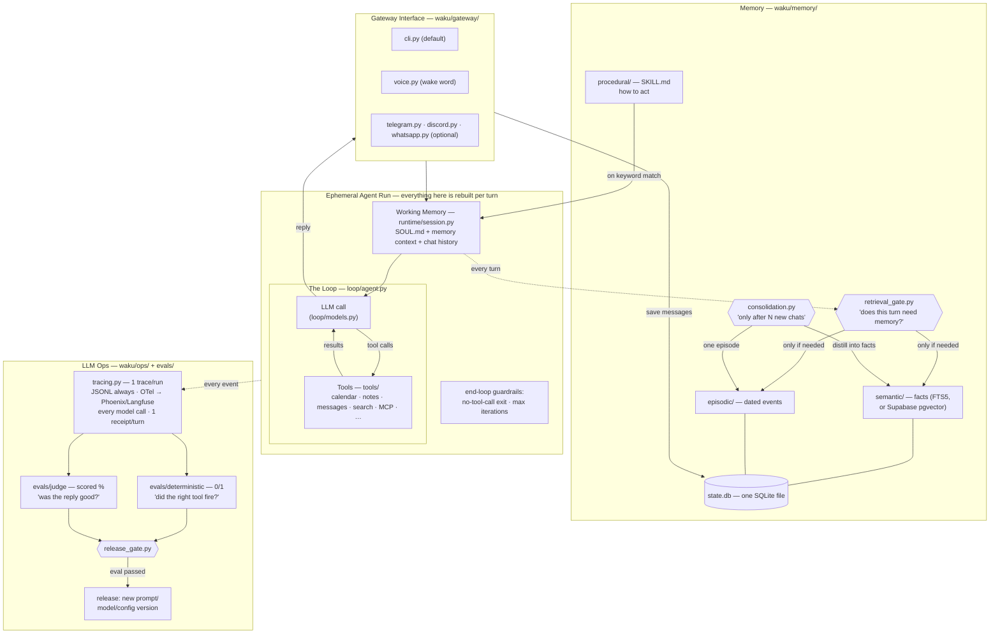
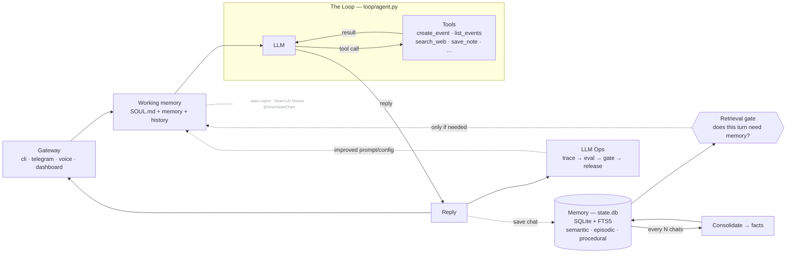

# Architecture — the whiteboard, refreshed

The same system as the two whiteboard diagrams from the previous videos
(the generic Harness/Loop/Memory/LLM-Ops one and the Hermes-specific one),
now with a file path on every box.

## The short version

> _Architecture of **waku-agent** — built on the series
> ([@ShenSeanChen](https://github.com/ShenSeanChen)). Code is MIT; **this diagram is licensed CC BY-NC-SA 4.0** —
> reuse it with credit to the channel, not for commercial resale._

### Which memories earn a slot

Retrieval finds the top facts for a message and, by default, puts all of them
in the prompt; consolidation keeps every fact the summariser proposes. With
`WAKU_SLOT_GATE=jev` and a `TYPESAFE_API_KEY`, Jev decides both
(`waku/memory/slot_gate.py`, spec 005): one call scores every retrieved fact on
"how much does leaving this one out change the answer?" and keeps those at
0.5 or above, which scored 12 of 12 on `lab/jev-system-one`'s cases; and
each proposed fact is scored on whether a later answer would need it before
it is stored. Any failure keeps today's behaviour, so a slow judge never costs
a memory. The turn card says how many it kept.

### ContractGuard review memory

`WAKU_CONTRACT_REVIEW=1` adds contract instructions to session context while
preserving the user's `SOUL.md`. `memory/contractguard.py` seeds ten clause facts
idempotently through the existing local store. Ten community procedures load
on clause-specific messages; the facade omits them when review mode is off.

The review gate selects semantic guidance and episodic history independently.
It validates its JSON response strictly and skips memory on failure. Domain
retrieval excludes ordinary facts and chat episodes. Exact clause history
decodes review summaries and compares timezone-aware timestamps across all
episodes rather than relying on an FTS top-k result.

`Memory.complete_review()` validates evidence against source offsets and stores
a versioned summary in the existing `episodes` table. It then runs optional
pattern consolidation immediately. The domain writer accepts only short,
grounded, novel lexical cues; benchmark predictions cannot create semantic
facts. Review mode skips generic chat-log consolidation because a chat reply
does not establish a completed review. These domain paths initially require
SQLite stores. [ContractGuard foundation](contractguard/foundation.md) describes
the record contract and remaining limitations.

The opt-in `review_contract` tool orchestrates ordinary parser, extractor, risk,
comparison and report functions inside the existing registry and loop. Each
clause gets separate gated context through `Memory.review_context()` and its
canonical procedure. History excludes the current document before top-k.
Python aligns exact model-proposed quotations to source offsets and validates
stage schemas before rendering a deterministic report. Structured extraction
records remain available to evaluators independently of report formatting.
Completed reviews call `Memory.complete_review()`; partial reviews make no
review-memory writes. Local ready journals support persistence retries and
completed artifacts support idempotent repeat calls.
[ContractGuard toolchain](contractguard/toolchain.md) describes the call path,
artifact schema and limits.

The evaluation-only `evals/contractguard/` package projects local CUAD documents
into source id and text before calling the existing extraction and risk stages.
Annotations remain on the scoring side. `scripts/run_eval.py` creates a fresh
SQLite home per arm, holds bundled procedures constant and saves source-checked
predictions, frozen matching metrics and run metadata. Full-memory can retrieve
previous predicted reviews; benchmark provenance prevents semantic learning.
Separate authored examples assess agreement with stated risk rubrics.
[ContractGuard evaluation](contractguard/evaluation.md) defines these policies.

The sequential `scripts/demo_review.py` reuses that predictor and deterministic
report renderer in a fresh home. It saves native review artifacts and atomically
replaces progress, memory snapshots and cumulative extraction metrics. The
dashboard's read-only `/api/contractguard` route validates artifacts beneath its
configured home, derives risk counts and projects saved metrics. `#reviews`
renders that payload with existing UI primitives and the safe Markdown renderer.
Provider setup allows this saved-data view while hiding chat without a usable
provider. [ContractGuard demo](contractguard/demo.md) explains this data flow.

### MEMORY.md vs state.db

Some assistants (e.g. Hermes) keep long-term memory as a single `MEMORY.md`
markdown file. Waku keeps the *queryable* source in `state.db` (the `facts` and
`episodes` tables, keyword-searchable via FTS5) **and** regenerates a readable
`~/.waku/MEMORY.md` mirror after every turn — so you get both: a real file you
can open, backed by a sturdy database. The dashboard's **Memory** tab is the
friendly view; the **Data** tab shows the raw `state.db` tables.

Each fact is also written to `~/.waku/memory/<id>.md`, one file per fact, in
the same pass. That is the layout of Claude Code's memory, which the Waku
Memory importer already uploads one memory per file. Episodes, `MEMORY.md` and
`state.db` are never written there (spec 003).

### Kept facts reach Waku Memory

When a `waku_memory` MCP server is connected, `app.py` gives consolidation a
`remember` callable, and consolidation sends every fact it keeps to Waku Memory
with `memory.remember` (kind `fact`, or `reference` for company research),
right after storing it locally (spec 006). Waku's MCP client names itself `waku-agent`, which Waku Memory labels
as Origin `waku`. The summariser also keeps research findings
(companies, products, markets, prices, launches) and flags a batch that is
company research. Facts from a flagged batch go to scope
`project:Company brain`; all other facts go to scope `global`. The
`consolidation` event lists the kept facts with their Waku Memory ids.

The `facts` table records each pending send with `synced = 0` and the scope.
A failed send is logged and never fails the turn, and the next consolidation
sends pending facts before new ones. Each kept fact in the event carries
`sent`: true when Waku Memory took it, false when it did not, and null without
Waku Memory. When `sent` is false, the chat's card reads "Kept on this agent
only" and says Waku Memory did not answer, and the receipt reads "2 kept, 2 on
this agent only", so neither claims a fact Waku Memory never stored. Rows from before spec 006 count as sent,
because the capture shim imports that backlog from `memory/<id>.md`. Hosted
containers consolidate every turn; laptops consolidate every 6 exchanges.
Without a connected server, nothing is sent.

### Research reports reach Waku Memory whole

The bundled `research-report` skill teaches the house language and the
waku-report v1 format (spec 007): one Markdown document whose first line is
`<!-- waku-report v1 -->`, with fixed sections and fenced JSON blocks
(`waku-metrics`, `waku-chart`, `waku-compare`, `waku-timeline`,
`waku-sources`) that waku.one renders. The format is frozen; a new component
is a new block name. When a turn's reply has that marker on a line of its
own, `waku/memory/reports.py` sends the report through the same `remember`
callable as one `semantic` memory, scope `project:Company brain` for company
or market research (one small-model question) and `global` otherwise. The
chat reply becomes the sentences before the marker plus "Report saved", the
turn emits a `report` event `{title, memory_id, scope, summary}` before
`done`, and the chat log keeps the short reply with the card in its meta.
The dashboard's chat draws that card (title, summary bullets, "Open report"
to `/memories/<id>` on www.waku.one, or on the waku.one site framing it), and
under it the facts a `consolidation` event says the turn kept (spec 008).
Without Waku Memory, or when the send fails, the reply keeps the whole
report and there is no event.

A turn saves at most one report. The model's own `memory_remember` tool
refuses a body holding the marker line, and if a report was saved by the
model anyway, `save` sends nothing more and the card points at that memory.
The skill says to name only the "treg cost" and never a total: the receipt
is the one place a turn's total is shown.

### Research reads the company brain first

A turn is research when the `research-report` skill matches its message:
research on companies, competitors or markets, or a request to save a brief,
summary or snapshot built from tool results ("save an audience brief to the
Company brain"). With
Waku Memory connected, `waku/memory/brain.py` runs `memory.search` twice before
the model's first call (spec 009): once for the subject (the message without
words like "research" and "the"), in every scope, and once for earlier
reports, kind `semantic`. The hits go into the system prompt under "What the
company brain already knows", each with its date and id, reports first, and
the skill says to start there, name the earlier report and its date, and
research only what is missing or older than 30 days. Each earlier report
found is read once with `memory.get` and goes into the prompt as its digest
(title, Summary, key numbers, at most 1,500 characters), and the loop cuts a
whole report the model fetched itself to its digest before each later call
(`reports.shrink_read`, passed to `run_loop` as `trim`). The same `trim`
step then cuts every other tool result longer than 4,000 characters that the
model has already read to its first 2,000 characters and a note
(`waku/loop/trim.py`); the newest results are always sent whole, and the trace
keeps every output whole. Each search is shown as
a `waku_memory_memory_search` tool call (waku.one reads its `entries` as
Used), the `done` payload and the turn's meta carry them as `used`, and the
dashboard's chat lists them under "Used from memory". The searches are not
folded into the chat log. A failed search is logged and skipped; the turn
goes on without it.

A turn that answered from memory does not keep that memory again. The answer
repeats what it read, so the summariser proposes it as new facts (2026-10-05:
one recall turn sent five copies of a report's findings to Waku Memory).
`app.py` passes consolidation everything the turn read (what the retrieval
gate found, what research read first, and what the model's own Waku Memory
searches, gets and recalls returned), the summariser is shown it, and
`consolidation.restates` drops a proposed fact that has a number or a date
and whose every name, number and date is already in it. A new fact the person
adds ("Zep raised again in 2026") has something the memory does not, so it is
kept; a fact with no number is never dropped by this check.

A turn that saved a report consolidates with it (spec 009 B): the summariser
is told the findings are in the report, a fact whose subject the report names
is dropped, and at most two facts are kept, as the person's own (scope
`global`). A laptop batch that holds an earlier report turn reads that report's
title and summary from the chat log's meta.

Each tool card shows `cost_usd` and the provider when the result carries them
(treg's call, through the hosted relay too). `WAKU_UNAVAILABLE_TOOLS` names tools a deployment does
not offer, and the system prompt says not to call them; hosted containers set
it to treg's `balance` and `resources_list`, which the relay refuses.

### The turn receipt

Every reply in the chat ends with one line that says what the turn did and
cost (spec 011), for example `claude-sonnet-5 · 12.4k in / 1.9k out · $0.064
est | treg 2 · $0.030 | memory 4 used · 2 kept · report saved | $0.094`.
Clicking it opens a table of the same numbers, with each kept fact and the
report linked to its page on waku.one. `waku/ops/receipt.py` builds it once
from the turn's own events; the `done` payload carries it as `receipt`, the
chat log keeps it in `meta.receipt`, and the trace gets one `receipt` event.
It holds names, counts, dollars and ids, and never a tool's arguments or
output.

Every `tool` trace line (schema `v: 2`, spec 012) carries the turn's
`turn_id`, its `source` (`treg`, `waku_memory`, `local` or `mcp:<server>`),
its span kind (`tool`, `retrieval` or `memory_write`), `duration_ms`, `ok`
and on a failure `error`, `cost_usd`, `endpoint_id` and `provider` when the
result names them, the Waku Memory `query`, `results`, `memory_ids` and
`retrieval_trace_id`, and its `args` redacted and trimmed to 500 characters.
Every `llm` line carries `turn_id` and `cost_usd`. Where an OpenTelemetry
GenAI attribute exists, the OTel export uses it, mapped in one table
(`GENAI` in `waku/ops/observability.py`). The dashboard's Observability page
(`GET /api/observability`) reads these lines, and reads a line written
before spec 012 with the same functions, leaving empty what it cannot derive.
Each turn it returns carries `scores`: the five turn checks of
`waku/ops/turn_evals.py` (source `code`, value 1, 0 or null for n/a), run on
every read rather than stored, plus any `score` event written for the turn:
the AI judge's, written once when someone presses "Judge this turn" (spec
015, `docs/evals.md`). The judge's call carries an `X-Waku-Turn` id of its
own, so the metering proxy answers its exact charge.

Every turn has a `turn_id`, written on the trace's `turn_start` and
`turn_end`, on each `usage.jsonl` row and in the chat log's meta. Every model
call writes a `usage.jsonl` row and an `llm` event: the loop's with `kind`
`loop`, and the small-model calls around it with `gate`, `consolidation`,
`report`, `triage` or `quick` (`metered()` in `waku/ops/tracing.py`).

Model dollars are an estimate from `waku/ops/pricing.py`, marked "est". On
the hosted free tier, every model call carries `X-Waku-Turn`, and the
metering proxy answers `GET /v1/turns/<turn_id>/charges` with the exact
charge and the credits Waku Memory took (`hosted/README.md`); the receipt
shows those instead. A proxy that does not know the turn leaves the estimate.

## Which file is which

- `waku/gateway/` — how text gets in and out: `cli.py`, `voice.py` (wake word),
  `telegram.py`, `discord.py` and `whatsapp.py`, started by `runner.py` and
  `supervisor.py`. Gateways only move text.
- `waku/runtime/session.py` — working memory for one turn: SOUL.md, memory
  context and chat history.
- `waku/loop/agent.py` — the loop. `loop/models.py` — pluggable providers over
  two wire formats.
- `waku/graph/` — the engine, node factories and `workflows/` (triage): opt-in
  structure around the loop. The loop never changes, a graph node can be a loop
  turn, and every failure fails open to the plain loop.
- `waku/tools/` — what the agent can call: `calendar.py`, `google_calendar.py`,
  `apple.py`, `notes.py`, `messages.py`, `search.py`, `github.py`,
  `workspace.py`, `memory_admin.py`, the MCP client and `experimental.py`.
  `registry.py` decides which are on.
- `waku/memory/` — semantic (FTS5), episodic and procedural (SKILL.md) memory,
  plus `retrieval_gate.py` (hero 1: does this turn need memory?) and
  `consolidation.py` (every N exchanges), `reports.py` (a research report
  goes to Waku Memory whole) and `brain.py` (a research turn reads Waku Memory
  first).
- `waku/ops/` — tracing (JSONL + OTel), the dashboard (localhost:7777),
  `release_gate.py`, and `compare_history.py` (the Compare arena's own JSONL
  scoreboard, never `state.db`).
- `waku/ops/static/` — the dashboard frontend. Read
  [context/design-system.md](context/design-system.md) before changing how
  anything looks.
- `evals/deterministic/` (0/1, pytest) and `evals/judge/` (DeepEval, scored).
  The two never mix. `evals/hosted_docker/` is a third tier for `hosted/`:
  0/1 and offline, but it needs a Docker daemon and its own CI job.
- `examples/` — teaching material, not product; one folder per topic.
- `~/.waku/` — runtime state: `state.db`, `calendar.ics`, `outbox/`, `traces/`.
  `WAKU_HOME` moves it; `make` sets it to the repo's own `.waku/`, which is
  gitignored. `waku/config.py` `resolve_home()` has the rules.
- `.env` — a model key is read from the environment, then the nearest `.env`
  from the working directory upward, then `<home>/.env`, the first one winning.
  A dashboard save writes to that nearest `.env` when one exists and to
  `<home>/.env` otherwise (`waku/config.py` `env_write_target()`).
  `waku/key_locations.py` reports those places to the setup page and to
  `waku connections`, as paths and yes or no, never a value.

## Design decisions worth stealing

- **The gate before retrieval** (not retrieval on every turn): a cheap-model judge
  answers "does this message need the user's memory?" — saves latency and, more
  importantly, keeps irrelevant memories from biasing answers.
- **Consolidation is batched** ("after N chats"), asynchronous to the reply path,
  and loss-safe: if the summarizer fails, the chat log stays unconsolidated.
- **Deterministic evals and judge evals never mix.** One is a unit test, the other
  is a scored opinion. The release gate requires 100% of the first and a threshold
  on the second.
- **Every layer has a boring default and a documented upgrade** — FTS5 → pgvector,
  mock calendar → Google Calendar, JSONL → Phoenix/Langfuse. The default is always
  zero-signup.
- **Graphs wrap the loop, never replace it.** When a turn needs shape (parallel
  steps, explicit routing), an opt-in graph workflow (`waku/graph/`) arranges nodes
  around the untouched loop — the `full_agent` node IS `run_loop`. Routers are plain
  code reading state a model wrote; every failure fails open to the plain loop; the
  dashboard renders the topology from the engine's own `describe()` so the picture
  can't drift. See `docs/agent-graphs-design.md`.

## What this deliberately is not

This tree, `waku/`, is not a framework, not multi-agent, and not production.
(Still not multi-agent even with graph workflows: a graph's `agent_node` is the
same loop invoked as one step — no peer-to-peer agent messaging, execution
follows the edges deterministically.) It's the readable blueprint — OpenClaw
and Hermes are the products; this is the afternoon read that explains them.
`hosted/` runs this same loop as a service instead; it is a deployment of
waku, not a second architecture (conventions.md §3). Spec 001 designed it and
it runs at agent.waku.one, one container per person. Each container reaches
that person's Waku Memory on its own: the gateway mints their Waku Memory key
at their first sign-in, and every start passes it in (spec 004). Every turn
then sends the facts it keeps to that Waku Memory (spec 006). Each can call
treg through the metering proxy, which holds the platform's treg token and
charges each call to the person's credits. A laptop reaches treg directly on
the person's own account, once `waku connect treg` has signed them in (spec
007). waku.one reads a person's chat history through the gateway's
`/v1/conversations` routes, which forward to the container's own
`/api/session`; the container keeps the one copy (spec 007). waku.one shows
the agent's own chat by framing `/embed/chat`, the dashboard's chat column
alone: `POST /v1/embed` gives it a one-time code, the code becomes an embed
session that reaches only the chat's routes, and only the origins in the
gateway's `WAKU_EMBED_ORIGINS` may frame the page (spec 008, and
`hosted/README.md`).
