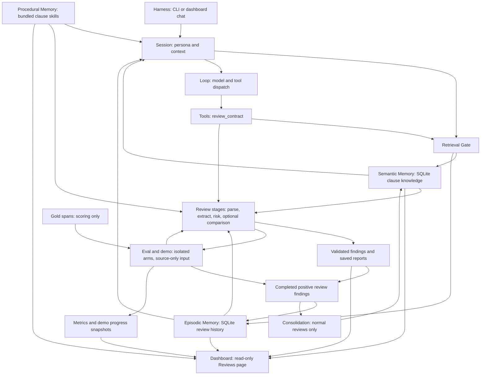

# ContractGuard architecture

ContractGuard adds clause-review tools and domain memory to Waku's existing
interactive loop. The benchmark and demo call the same extraction and risk
functions directly so experiments can control source order and memory policy.

## Interactive review

The harness sends a chat message to session context assembly. Contract mode
adds the contract persona, gated facts and history, and matching skills before
the existing loop asks a model to respond. Tool dispatch calls `review_contract`
when the model requests a review.

The review tool parses complete plain text and reviews each requested canonical
clause. Its gate independently chooses semantic and episodic retrieval for that
clause. The history query excludes the current source id before taking up to
three episodes. The tool loads each clause's exact procedure independently of
the conversational loader's two-skill limit.

Extraction requests exact quotations and occurrence numbers. Python locates
those quotations in the source and validates half-open character offsets.
Risk assessment refers to extracted evidence indices. Optional comparison
requires semantic guidance and validates both source and guidance quotations.
The report renderer consumes validated findings; it never supplies metric input.

The tool saves the document, structured result and report before learning from
completed positive findings. A ready journal lets persistence retry without
repeating completed model stages. A completed cache is validated before reuse.
Partial reviews retain errors and validated stages but do not add review episodes.

Normal review completion stores prediction history and may consolidate short,
novel lexical cues grounded in the source. Consolidation excludes full contracts,
reports, recalled facts and repeated generic guidance. Benchmark provenance
disables semantic promotion. These checks validate stored evidence and scope;
they do not prove a model's commercial or legal interpretation.

## Controlled evaluation and observation

The evaluator separates source-only prediction input from gold annotations.
Its predictor parses the complete source and calls extraction and risk stages
directly. It omits interactive guidance comparison, tool dispatch and review
caching. All arms retain the same bundled procedures. Baseline skips memory
retrieval; semantic-only gates fixed facts; full-memory also gates prior
prediction episodes. Every arm gets a fresh home, and all semantic seeds remain
fixed throughout benchmark runs.

The demo uses this predictor and generates native review artifacts from its
validated findings. It writes queue and memory snapshots before calls and after
reviews. The existing dashboard reads those artifacts, generated metrics and
local memory counts through `GET /api/contractguard`. That route starts no
agent or model call. Native interactive reviews supply reports but have no demo
queue or evaluation snapshot unless a runner generated one.

## Code map

| Component | Implementation |
|---|---|
| Harness and session | [runtime/session.py](../../waku/runtime/session.py), [ops/dashboard.py](../../waku/ops/dashboard.py) |
| Loop and tools | [loop/agent.py](../../waku/loop/agent.py), [tools/contract_review.py](../../waku/tools/contract_review.py) |
| Review stages | [contract_parser.py](../../waku/tools/contract_parser.py), [clause_extractor.py](../../waku/tools/clause_extractor.py), [risk_scorer.py](../../waku/tools/risk_scorer.py), [clause_differ.py](../../waku/tools/clause_differ.py), [report_generator.py](../../waku/tools/report_generator.py) |
| Evidence and finding contracts | [contract_schema.py](../../waku/tools/contract_schema.py) |
| Memory and retrieval gate | [memory/__init__.py](../../waku/memory/__init__.py), [memory/contractguard.py](../../waku/memory/contractguard.py), [retrieval_gate.py](../../waku/memory/retrieval_gate.py) |
| Procedures | [skills/community/](../../skills/community/) |
| Consolidation | [memory/consolidation.py](../../waku/memory/consolidation.py) |
| Eval | [predictor.py](../../evals/contractguard/predictor.py), [runner.py](../../evals/contractguard/runner.py), [matching.py](../../evals/contractguard/matching.py), [metrics.py](../../evals/contractguard/metrics.py) |
| Demo | [demo_review.py](../../scripts/demo_review.py), [evals/contractguard/demo.py](../../evals/contractguard/demo.py) |
| Dashboard reader and view | [ops/contractguard.py](../../waku/ops/contractguard.py), [js/contractguard.js](../../waku/ops/static/js/contractguard.js) |

[Toolchain](toolchain.md) specifies artifact and retry contracts.
[Evaluation](evaluation.md) specifies matching and leakage controls.
[Demo](demo.md) specifies dashboard data sources and limits.
