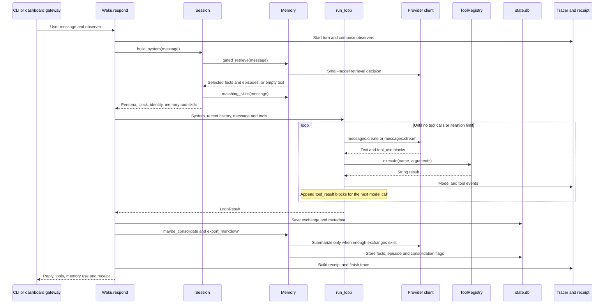

# ContractGuard Phase 0 architecture map

Waku already supplies ContractGuard's harness, agent loop, three memory stores,
provider adapter, traces and eval infrastructure. Phase 1 adds opt-in domain
memory and review procedures. ContractGuard still needs grounded extraction
and a benchmark runner. Sections A–F preserve the Phase 0 inspection and its
recommendations; section G reconciles them with the Phase 1 implementation.

This inspection covers the checkout on 2026-10-05. Source links identify the
functions that implement each behavior. Provider names and model defaults below
describe the registry in this checkout; they do not establish live availability.

## A. Current Waku execution path

### One request through the harness

The diagram shows the default full turn. A reply without tool calls skips tool
execution. A batch below the consolidation threshold skips the summarizer.
Tracing starts before context assembly and accompanies execution; it is not a
separate operation that starts after persistence.

1. [`waku/__main__.py`](../../waku/__main__.py) selects the CLI or another
   gateway. [`gateway/cli.py`](../../waku/gateway/cli.py) receives terminal
   text through `console.input()` and calls `Waku.respond()`. Voice, Telegram,
   Discord and WhatsApp adapters also pass text to that harness.
2. [`ops/dashboard.py`](../../waku/ops/dashboard.py) receives HTTP requests in
   `Handler.do_GET()` and `Handler.do_POST()`. `POST /api/chat/stream` sends
   events through server-sent events; `/api/chat` collects the same final
   `done` payload through `chat_stream()`. `browser_agent.py` caches the agent
   and protects turns with `agent_lock`. Waku uses stdlib
   `ThreadingHTTPServer`, not FastAPI. The separate hosted gateway uses aiohttp.
3. [`app.py`](../../waku/app.py) assembles settings, SQLite, client, `Memory`,
   tools, `Session` and `Tracer`. Its injectable `client` and `conn` let evals
   exercise real wiring without a live provider.
4. [`runtime/session.py`](../../waku/runtime/session.py) builds the system
   prompt in `Session.build_system()`. `load_soul()` creates or reads
   `<settings.home>/SOUL.md`; the source default is `DEFAULT_SOUL`. It appends
   local time, model/provider identity, unavailable-tool instructions, gated
   memory and matching skill bodies. The repository has no root `SOUL.md`.
5. `Waku._run_full_turn()` adds the last `history_turns * 2` messages and the
   new request. The default window covers 12 exchanges. A research request
   with Waku Memory connected can also run `brain.read_first()` before the loop.
   Those searches are separate from local gated retrieval.
6. [`loop/agent.py`](../../waku/loop/agent.py) executes `run_loop()`. Each
   iteration calls `client.messages.create()` or `.stream()` with the system,
   messages and `tools.schemas()`. It appends assistant blocks, executes each
   `tool_use`, then appends a user message containing `tool_result` blocks.
   No tool calls ends the turn; the configured iteration limit bounds it.
7. `Session.add_exchange()` saves user and assistant history and calls
   `Memory.log_chat()`. Tool activity becomes a compact history note rather
   than a complete durable transcript of every result. `chat_log.meta` holds
   gate, graph, model, latency, tools, reports and later the receipt/turn id.
8. `Waku.respond()` invokes consolidation, exports memory mirrors and builds
   the receipt before returning. A connected Waku Memory server can receive a
   marked research report before chat persistence. Contract review reports
   do not yet have such a route.

### Providers and DeepSeek

[`loop/models.py`](../../waku/loop/models.py) loads
[`providers.toml`](../../waku/providers.toml). `get_client()` resolves model
defaults and returns an Anthropic client or `OpenAICompatClient`. Both present
the Anthropic-shaped `messages` interface expected by the loop and memory.
`OpenAICompatClient` converts tool schemas and messages to OpenAI Chat
Completions, then converts responses back to text/tool-use blocks. It preserves
tool call ids and normalizes token usage. Its token-budget fallback retries
only errors about `max_completion_tokens` or `max_tokens`.

The existing `deepseek` row uses `kind = "openai"`,
`https://api.deepseek.com`, `DEEPSEEK_API_KEY` and `deepseek-v4-pro` for both
the main and small models. A later run can select `WAKU_PROVIDER=deepseek` and
explicit model overrides through existing settings. No new DeepSeek client,
provider row or logo is needed. Phase 0 makes no live model call and reads no
secret values. The adapter does not currently expose a temperature argument;
Phase 3 must record provider defaults honestly or add a tested decoding option.

### Tool contract and return path

[`tools/registry.py`](../../waku/tools/registry.py) defines
`Tool(name, description, input_schema, fn, wants_notify=False)`.
[`tools/__init__.py`](../../waku/tools/__init__.py) builds the registry from
`make_tool()` factories. Default tools include calendar, notes, messages and
search; memory management appears when memory is wired. Apple, GitHub,
experimental and MCP capabilities have explicit opt-in paths.

`ToolRegistry.execute()` passes keyword arguments to `fn`, optionally supplies
`_notify`, and returns its string. Unknown tools and exceptions become error
strings that the model can observe. The registry does not validate arbitrary
arguments against JSON Schema or verify grounding. A future contract tool must
validate its own inputs and evidence, serialize structured findings as JSON,
and keep evaluation consumers independent of prose reports. Every registered
schema enters every loop call, so five new default tools would affect all users.

### Semantic and episodic memory

[`db.py`](../../waku/db.py) creates `state.db`, FTS5 indexes and additive
migrations. [`memory/__init__.py`](../../waku/memory/__init__.py) selects the
stores and provides retrieval, chat logging and consolidation.

| Store | Current persisted fields | Current interface and retrieval |
|---|---|---|
| Semantic SQLite | `facts`: `id`, `subject`, `content`, `source`, `created_at`, `synced`, `scope` | `SqliteFactStore.add()` lowercases the subject. `search()` returns `[subject] content` strings using FTS5/BM25 rank. `search_with_ids()`, `list()`, `update()` and `delete()` support management. |
| Episodic SQLite | `episodes`: `id`, `happened_at`, `summary`, `created_at` | `SqliteEpisodeStore.add(summary, happened_at)` stores a dated summary. `search()` orders by FTS rank, then descending event date; `recent()`, `list()` and `delete()` support browsing and management. |
| Raw conversation | `chat_log`: `id`, `role`, `content`, `consolidated`, `session_id`, `created_at`, plus migrated `source` and `meta` | `Memory.log_chat()` writes two rows per exchange. Session labels organize history but do not isolate long-term memory or consolidation. |

[`semantic/base.py`](../../waku/memory/semantic/base.py) defines `FactStore`.
Its methods include `settle()` for eventually consistent backends. SQLite has
no deduplication constraint or built-in idempotent seeding. Supabase, Mem0, Zep
and LangMem adapters are selectable; SQLite remains the local default.
[`episodic/store.py`](../../waku/memory/episodic/store.py) has no structured
contract-review columns. Notion is the optional episodic adapter.

[`semantic/store.py`](../../waku/memory/semantic/store.py) turns query tokens
into an OR expression, with prefix matching for unsegmented CJK scripts.
Fact search returns nothing for an unsearchable query; episode search falls
back to recent episodes. Ranking by relevance does not guarantee the latest
episode for a clause type. Structured review fields, exact category filtering,
idempotency and latest-review lookup need explicit domain behavior.

[`tools/notes.py`](../../waku/tools/notes.py) provides the explicit `save_note`
write path. It inserts directly into local SQLite rather than the selected
`Memory.facts` backend. Consolidation uses that selected store. ContractGuard
seeding should use the fact-store interface so backend selection remains clear.

### Procedural memory and retrieval gate

[`procedural/loader.py`](../../waku/memory/procedural/loader.py) recursively
scans only files named `SKILL.md`. It parses `name` and `description` frontmatter
and loads matching bodies into the system prompt. Bundled skills come from
root `skills/` in a checkout or `waku/skills/` in a wheel; installed skills come
from `<home>/skills/`. The wheel already includes root skills through
`pyproject.toml`. A changed file causes a rescan on the next match.

Matching requires two shared words of at least three alphanumeric characters
between the message and a skill's name/description. The loader selects at most
two skills, ordered by overlap and scan order for ties. Ordinary `.md` runbooks
under `skills/clauses/` would never load. Supporting ten procedures does not
mean that a single full-contract request automatically loads all ten. Clause
tasks will need separate matching/context assembly in Phase 2. Referenced
resources have no automatic shared-content expansion in this loader.

[`retrieval_gate.py`](../../waku/memory/retrieval_gate.py) accepts
`(client, small_model, message)` and returns `(retrieve, query, reason)`.
It makes one model call requesting JSON with those three fields. Exceptions,
bad JSON and replies without JSON retrieve using the original message. Valid
JSON with a missing decision currently becomes false; string booleans are not
strictly validated. The prompt asks about personal memories and sees only the
message, not skill bodies, chat history, candidate memories or parsed clauses.

`Memory.gated_retrieve()` searches facts with `retrieval_top_k` (default four)
and episodes with `top_k=3` on the same query when the gate says yes. It joins
their formatted strings for `Session.build_system()`. A skip suppresses both
stores. Skills still match independently. The optional Jev slot gate selects
facts after retrieval and filters proposed facts before persistence; it is
disabled by default and is not the same decision as the retrieval gate.

ContractGuard needs a domain-aware decision and independent semantic/episodic
selection to express “use clause guidance but skip history.” That behavior
cannot be obtained merely by changing the existing prompt.

### Consolidation and persistence

[`consolidation.py`](../../waku/memory/consolidation.py) reads all
unconsolidated chat rows in id order. `kept_if_due()` returns immediately until
there are `consolidate_every * 2` rows; the laptop default is six exchanges.
`Waku.respond()` calls it synchronously after logging the exchange. It is not
a background worker. Hosted configuration can lower the threshold to one.

The summarizer proposes `{facts: [{subject, content}], episode,
company_research}`. Accepted facts enter the configured semantic store and one
dated summary enters the episodic store. Successful processing marks the
selected rows consolidated. A model/JSON failure leaves those flags unset for
retry. Writes commit through the stores separately; the whole operation is
not one atomic transaction, so a later storage failure can leave partial work.

Existing filters avoid selected report findings and numeric/date restatements
of recalled memory. They do not enforce general semantic uniqueness, evidence
validity, durability, contract identity or benchmark isolation. `restates()`
does not discard facts without numbers. Optional Waku Memory sync tracks
pending local facts and retries sends during a later due batch; disconnected
local operation sends nothing. Memory exports regenerate `<home>/MEMORY.md`
and `<home>/memory/<id>.md`; episodes stay out of the per-fact folder. The
mirror reads local SQLite, which is not a complete mirror of remote adapters.

A completed-review event is not currently defined. Phase 1 can provide typed
episode persistence and test it with fixtures. Phase 2 must supply a validated
completed review; batched chat summaries cannot serve as authoritative findings.

### Graphs, tracing, receipts and dashboard

[`graph/engine.py`](../../waku/graph/engine.py) implements `Graph`, `Node`,
`run_graph()` and `describe()`. Nodes return keys merged into state; code
routers select edges, and independent ready nodes can execute concurrently.
[`graph/nodes.py`](../../waku/graph/nodes.py) supplies tool, LLM and agent node
factories. An agent node calls the existing loop. `workflows/triage.py` can
select quick or full replies when graph workflows are enabled; `app.py` falls
back to the full loop on graph failure. `workflows/gather.py` demonstrates
parallel reads and synthesis. ContractGuard needs no replacement graph engine.

[`ops/tracing.py`](../../waku/ops/tracing.py) composes gateway display,
tracer and harness capture observers. `Tracer.turn()` creates a `turn_id` and
writes `turn_start`; `end_turn()` writes the reply and iteration count.
JSONL traces live at `<home>/traces/<date>.jsonl`, and model usage appends to
`usage.jsonl`. `metered()` records side-model calls such as gate and
consolidation. Streaming text deltas go to the UI, not trace lines. OTel export
requires the optional tracing extra and a configured endpoint.

[`ops/observability.py`](../../waku/ops/observability.py) normalizes model
and tool events, derives sources, failures, memory ids and estimated cost, and
redacts/trims tool arguments. Tool output and turn text can still contain full
user data. [`ops/receipt.py`](../../waku/ops/receipt.py) builds one receipt
from the turn's events; the harness stores it in chat metadata and traces.
Local fact/episode retrieval currently exposes a gate decision and formatted
context, not complete item-level retrieval telemetry. The receipt's `used`
items cover the separate Waku Memory research reads. ContractGuard must add
local retrieval counts rather than mistake that list for every local memory hit.

Dashboard reads include `/api/data`, `/api/session`, `/api/observability` and
`/api/events`. Mutations include `/api/memory`, `/api/settings`, `/api/query`
and chat routes. [`ops/static/README.md`](../../waku/ops/static/README.md)
describes the actual frontend: `index.html`, `embed.html`, `style.css` and
classic scripts under `js/`. `main.js` loads data into `D` and dispatches
through `VIEWS`; `render.js` renders chat/SSE, `memory.js` handles memory edits,
`observe.js` displays traces and evals, and `graph.js` renders `Graph.describe()`.
There is no current `app.js` despite dashboard source comments naming it.

New routes need both dashboard route tests and an entry in
[`hosted/core/policy.py`](../../hosted/core/policy.py). That file remains
Elastic License 2.0.

Production additions under `waku/` remain MIT. Future UI work must use design
tokens and leave copied `static/design/` files untouched. ContractGuard does
not require code to move across the deployment boundary.

### Deterministic and judge evals

[`evals/conftest.py`](../../evals/conftest.py) assigns a throwaway home before
config imports. [`evals/helpers.py`](../../evals/helpers.py) provides
`ScriptedClient`, text/tool blocks, responses and `make_waku()` for injectable
offline turns. Tests use `tmp_path`, real SQLite, scripted model results and
monkeypatches. `test_retrieval_gate.py` tests parsing and failure behavior;
`test_consolidation.py` tests thresholds, writes and retry bookkeeping;
`test_memory_search.py` tests FTS behavior; `test_skill_triggers.py` tests
positive triggers, unrelated prompts and collisions. Backend conformance,
dashboard routes, receipts, traces and graph behavior also have offline tests.

Deterministic tests can verify prompt construction and reject unsupported
structured findings. They cannot prove that a live model obeys a persona or
finds a clause correctly. Existing live cases under `evals/deterministic/`
skip without an active provider key, so “deterministic” alone does not ensure
a test invocation will avoid network calls when keys are available.

[`evals/judge/anthropic_judge.py`](../../evals/judge/anthropic_judge.py) adapts
the same provider client to DeepEval, despite its Anthropic-specific name.
Response and retrieval-gate evals use `GEval`, explicit criteria and score
thresholds, typically 0.6. `test_turn_judge.py` exercises the separate turn
grounding judge with a 0.7 boundary. These evals need a live provider; CI runs
the offline tier. `ops/release_gate.py` runs deterministic tests first, then
judge tests if a key exists, and persists results in the agent home.

CUAD scoring will need deterministic normalization and span matching over
saved predictions. Generating those predictions with a live LLM belongs in an
explicit benchmark command, not an offline test. The repository has no CUAD
loader, clause metrics, contract fixtures or ContractGuard benchmark today.

## B. ContractGuard requirements mapped to Waku

These changes are recommendations for later phases. Risk describes what a
future implementation must verify, not behavior supplied by Phase 0.

| Requirement | Existing Waku component | Modification needed and reason | Risk |
|---|---|---|---|
| Contract persona, English reports, HIGH/MEDIUM/LOW, uncertainty and source citations | `Session.build_system()` and runtime `SOUL.md` | Add an explicit review-mode instruction block; preserve the person's existing persona. | Prompt presence alone does not guarantee compliance. |
| DeepSeek development provider | `providers.toml`, `Settings`, `get_client()` | Select existing provider and pin model ids for runs. | Registry defaults are not a smoke test. |
| Ten canonical clause knowledge entries | `FactStore`, local `facts` | Represent definitions, variants, red flags and guidance in retrievable text with stable subjects; add explicit idempotent seeding. | SQLite inserts duplicates and FTS uses lexical relevance. |
| Structured review episodes and latest clause history | `SqliteEpisodeStore.add/search/list` | Encode validated versioned review fields in existing summaries first; filter decoded records by category and date for exact lookups. | Generic summaries and top-k FTS cannot ensure exact fields or latest history. |
| Ten procedural runbooks | `SkillLoader`, bundled skill packaging | Add ten named `SKILL.md` directories with specific triggers and concise bodies. | Shared words can cause collisions; only two skills load per message. |
| Separate semantic guidance and historical retrieval | `should_retrieve()`, `Memory.gated_retrieve()` | Extend the existing gate with domain context and store selection while preserving its legacy interface. | A changed prompt alone cannot select stores; failures must remain explicit. |
| Durable, novel, grounded consolidation | `kept_if_due()`, `restates()`, slot gate | Add opt-in domain output validation and duplicate guards; persist only reusable evidence-backed knowledge. | Existing filters do not guarantee uniqueness or stop benchmark leakage. |
| Source-preserving parser and stable offsets | Plain Python functions, `Tool` factories | Add deterministic segmentation in Phase 2; retain original text and validate offsets. | Normalization can invalidate source offsets. |
| Structured clause extraction and confidence | Provider adapter, loop and registry | Use existing tool dispatch, JSON string results and independently validated finding records. | Hallucinated evidence or lost tool-result fields can invalidate positives. |
| Separate risk scoring and clause comparison | Existing tool factories or graph node functions | Define grounded outputs and curated deterministic risk rules separately from extraction labels. | Clause presence is not a risk gold label. |
| English Markdown reports | Workspace artifacts and existing Markdown rendering | Render validated findings deterministically; explicitly choose local artifact persistence. | Existing research-report upload is a different format and can shorten chat replies. |
| Ordered review workflow and completed-review event | Loop, optional `Graph`/node factories, observer | Arrange existing mechanisms only after domain functions exist; emit a typed completion for episode persistence. | Model-selected tool order alone does not guarantee every review stage ran. |
| CUAD extraction metrics and span matching | Offline pytest conventions and explicit scripts | Add an evaluation-only loader, one matcher and saved predictions/config/metrics. | Target names must be checked against actual dataset labels and split metadata. |
| Risk quality and judge rubric | Curated offline cases, DeepEval and turn judge | Add separate risk cases and a versioned grounding/recommendation rubric. | Judge opinions cannot substitute for extraction P/R/F1. |
| baseline / semantic_only / full_memory | Injectable `Settings.home`, stores and client | Give each arm a fresh home and explicit retrieval/write/skill policy; control history and connected adapters. | Separate sessions share memory; a home alone does not disable bundled skills or remote stores. |
| Equal experiment settings | Shared client abstraction and run metadata | Pin clause list, model, prompt, order and matcher; resolve procedural policy and decoding before runs. | Enabling procedures only in full memory changes more than persistent memory. |
| Latency, calls, tokens, cost and retrieval overhead | `Tracer`, `metered()`, receipt and usage ledger | Reuse events and add local retrieval counts/ids and per-stage events. | Current traces do not supply every requested benchmark metric; dollars may be estimated. |
| Deterministic demo and reports | CLI gateway, injectable harness, scripts | Add a seeded explicit runner after metrics exist, without runtime resets. | Selected contracts cannot establish an unmeasured improvement. |
| Progress, risk matrix, memory growth and eval dashboard | stdlib routes, static `js/`, trace/data readers | Extend existing views with real review records and benchmark artifacts in Phase 4. | New routes need hosted policy; frontend changes need browser checks. |
| Learning notes, README and measured resume material | Docs index, repository writing rules | Keep repository prose English, maintain attribution and publish only measured results. | README has a 200-line cap and brand assets have a separate license. |

## C. Exact Phase 1 file list

Phase 1 should make ContractGuard opt-in through `WAKU_CONTRACT_REVIEW`, default
off. It should reuse `Memory`, stores and session assembly rather than replace
Waku's default persona or create another package. The file list below selects
one implementation direction against existing APIs. A proposal must precede
memory-interface and prompt changes under conventions §2; Phase 0 supplies the
architecture evidence, not approval to start that implementation.

| Existing file to modify | Phase 1 responsibility |
|---|---|
| `waku/config.py` | Add an explicit review-mode setting with a false default. |
| `waku/runtime/session.py` | Append review instructions only in review mode; keep runtime `SOUL.md` loading and the user's content intact. |
| `waku/memory/__init__.py` | Wire opt-in seeding, store-selective retrieval and domain consolidation through the existing facade. |
| `waku/memory/retrieval_gate.py` | Add a domain-aware decision with semantic/episodic selection; retain `should_retrieve()`'s three-value interface for existing callers. |
| `waku/memory/consolidation.py` | Accept opt-in domain instructions and validate/deduplicate proposed knowledge through domain helpers; preserve default batching and failure behavior. |
| `evals/deterministic/test_skill_triggers.py` | Add positive messages for all ten runbooks and negative/collision cases against all bundled skills. |
| `docs/architecture.md` | Describe opt-in contract context, retrieval and consolidation once they exist. |
| `docs/README.md` | Index the foundation usage/proposal document. |
| `docs/contractguard/phase0-architecture-map.md` | Reconcile selected interfaces with what Phase 1 actually implements. |
| `PLAN.md` | Record Phase 1 status, checked tasks, changed files and measured validation. |

| New file to add | Phase 1 responsibility |
|---|---|
| `waku/memory/contractguard.py` | Keep canonical clause records, persona instructions, idempotent seed helpers, validated review-summary encoding/decoding, exact history lookup and domain novelty/grounding helpers together. |
| `evals/deterministic/test_contractguard_foundation.py` | Exercise actual session context, ten seeds, repeat seeding, retrieval, episode round trips, exact category/history lookup, gate store selection, consolidation and mode-off regressions with real SQLite and scripted clients. |
| `docs/contractguard/foundation.md` | Specify the memory/prompt proposal and opt-in usage, including encoded episode limits and explicit initialization behavior. |
| `skills/community/termination-for-convenience/SKILL.md` | Review termination rights and notice requirements. |
| `skills/community/uncapped-liability/SKILL.md` | Review unlimited exposure and limitation carve-outs. |
| `skills/community/cap-on-liability/SKILL.md` | Review liability caps and their coverage. |
| `skills/community/ip-ownership/SKILL.md` | Review IP assignment and retained rights. |
| `skills/community/non-compete/SKILL.md` | Review competitive restrictions and their bounds. |
| `skills/community/change-of-control/SKILL.md` | Review control-change rights and conditions. |
| `skills/community/governing-law/SKILL.md` | Review governing-law evidence and ambiguity. |
| `skills/community/indemnification/SKILL.md` | Review indemnity scope and obligations. |
| `skills/community/confidentiality/SKILL.md` | Review confidentiality duties, exceptions and duration. |
| `skills/community/exclusivity/SKILL.md` | Review exclusivity scope and exceptions. |

The existing loader, skill validator and wheel inclusion already support these
skill paths. Phase 1 does not need edits to `loop/agent.py`, `loop/models.py`,
`providers.toml`, `tools/registry.py`, `db.py`, the graph engine, dashboard or
`pyproject.toml`. A versioned structured payload inside the existing episode
summary avoids a schema migration and retains the Notion adapter's two-argument
write interface. Its exact query helper must not rely on a small top-k search
or parse unrelated ordinary summaries as review events. If efficient structured
SQL queries become necessary, a later proposal should choose additive columns.

Phase 1's synthetic completed-review fixtures can exercise persistence and
consolidation without implementing extraction. Phase 2 will connect those
helpers to real validated findings. Domain deduplication must compare stored
content, not merely suppress an entire clause subject, because one category can
accumulate several distinct reusable facts.

## D. Proposed-path audit and stale assumptions

| PLAN path or assumption | Checkout evidence and resolution |
|---|---|
| `AGENTS.md`, `PLAN.md`, required reading and inspected `waku/` areas | All exist. `PLAN.md` began as an untracked user file. Phase 0 updates it without replacing the roadmap. |
| `docs/contractguard/phase0-architecture-map.md` | Phase 0 creates it and indexes it in `docs/README.md`. |
| `docs/contractguard/evaluation.md`, `interview-notes.md` | Neither exists yet. They remain Phase 3 and Phase 5 documentation targets. |
| Root `SOUL.md` | It does not exist and `load_soul()` would not read it. Use the existing runtime home and opt-in session instructions. Do not copy `hosted/templates/SOUL.md` into MIT runtime code. |
| Ten `skills/clauses/*.md` files | No such directory/files exist. The loader scans `SKILL.md` only. Use the ten community directories listed in section C. |
| `waku/tools/contract_parser.py`, `clause_extractor.py`, `risk_scorer.py`, `clause_differ.py`, `report_generator.py` | None exists. The parent package and factory pattern are valid Phase 2 extension points, but registration must be opt-in and satisfy the footprint ladder. Pure helpers need not all become model-facing tools. |
| `evals/contractguard/` and `evals/.../test_clause_extraction.py` | Neither exists. Put offline tests under `evals/deterministic/`, scored model evals under `evals/judge/`, and explicit benchmark support outside auto-collected live tests. Exact Phase 3 support paths await the finding schema. |
| `scripts/demo_review.py`, `scripts/run_eval.py` | Neither exists; `scripts/` exists. The benchmark command belongs to Phase 3 and the demonstration to Phase 4. |
| `artifacts/eval/<run_id>/{metrics.json,predictions.jsonl,config.json}` | No current benchmark directory or ignore rule exists. Select an explicit artifact root and ignore large generated runs in Phase 3. |
| `waku/runtime/session.py`, `waku/memory/*`, `waku/ops/dashboard.py`, `waku/ops/static/*`, `README.md`, `pyproject.toml` | All referenced components exist. Memory changes need a proposal; dashboard work waits for Phase 4; no new dependency or package rename is needed for Phase 1. |
| Semantic and episodic conceptual JSON schemas | Current stores hold text facts and dated summaries, not those domain columns. Add validation/encoding through existing APIs first. |
| Clause-level gate in the target diagram | Current gate runs once per user turn before the loop. Phase 2 must explicitly assemble context per clause if that is required. |
| Consolidation after every completed review | Default runs every six exchanges and reads across all sessions. Typed review storage and semantic consolidation need separate completion/threshold policies. |
| All ten procedures automatically reach context | Only two keyword-matched skills load; a full-review orchestrator must select procedures per clause. |
| Chinese README/learning notes | Conventions §1 requires English throughout the repository and takes precedence over PLAN's permission. |
| Memory-only comparison with procedures enabled only in full_memory | Those arms also vary procedural context. Hold it constant or label the comparison as a combined memory-system experiment. |
| Status document as a complete inventory | `docs/status.md` still says hosted code does not exist, while `hosted/` and architecture docs show a deployment. Treat that as upstream documentation drift; do not expand Phase 0 into hosted work. |
| Offline tests prove legal behavior | Offline tests verify contracts, schemas and scripted outputs. Live extraction and risk quality remain unmeasured. |

The audit verifies proposed paths against this checkout. It does not verify an
external CUAD release. Before Phase 3, inspect the actual dataset's clause labels,
official split and license; define a canonical label map and report any of the
ten targets that lack annotations. Gold labels must never become agent context.

## E. Learning checkpoint and next-phase decisions

The request “review this agreement's uncapped liability clause” enters the CLI
or HTTP handler and reaches `Waku.respond()`. `Session.build_system()` asks
memory for relevant context and procedures. The loop sends that system prompt,
recent conversation and tool schemas to the provider. A tool request names a
registry function; its string result becomes a tool-result block for the next
model call. The final reply enters chat history and SQLite, then any due
consolidation creates facts and an episode. Observers record events throughout
the turn, and the harness persists a receipt before returning.

SQLite search, skill matching, tool dispatch, history construction, graph
routing, metadata writes and receipt construction execute deterministic code.
The default gate decision, consolidation content, loop reasoning, graph triage
classification and judge scores require a model. Optional remote stores and
tools require their configured services even when local dispatch is deterministic.

Before Phase 1 implementation, resolve these decisions in the memory proposal:

- Define strict gate output validation and store-selection failure behavior
  while keeping existing personal-assistant callers compatible.
- Define versioned review-summary fields, evidence validation and exact latest
  lookup. Include contract name, id, clause type, risk, finding, evidence,
  recommendation and timestamp from PLAN's two field lists.
- Define explicit seed initialization and duplicate comparison. Preserve
  genuinely new knowledge about an already-known clause category.
- Separate trusted domain seed content from reviewed contract text, model
  findings and benchmark annotations. Recalled memory is not automatically
  new knowledge, and current test answers must never enter the writer.
- Keep one opt-in mode for domain behavior. Later ablation arms need finer
  controls for histories, writes, skills, local stores and remote connections.
- Choose whether procedural instructions remain equal across ablation arms;
  publish that choice before collecting metrics.

Phase 0 deliberately leaves provider smoke tests, dataset downloads, extraction,
risk scoring, reports, benchmarks and dashboard implementation to their phases.
No ContractGuard quality or memory-improvement metric has been measured.

## F. Phase 0 verification

Phase 0 passed all 17 rulebook tests, 115 focused architecture tests, the
existing skill validator and pinned ruff checks. Local documentation links
resolve, and Phases 1–5 remain TODO. Phase 0 changed no production behavior and
added no behavioral eval.

The initial corrected full-suite run returned 3065 passed, 218 skipped and
3 failed. UTC rechecking cleared the time-window failure; two hosted tests
still failed on CI-count persistence and concurrent capacity reservation.

The user-requested follow-up repaired all three cases. The deployment script
now uses a jq binding that does not collide with the `label` keyword. The
capacity test holds a cold-start reservation explicitly and checks both tenant
arrival orders. The time-window test sets and restores UTC and Asia/Shanghai
and verifies each local-midnight result. These repairs preserve existing
gateway and time-window behavior.

The final full run in Asia/Shanghai passed 3071 tests and skipped 218, with no
failures or errors. All six focused regression cases and pinned lint passed.
Both capacity cases failed when a temporary test plugin bypassed admission,
confirming that the tests detect excess starts. [`PLAN.md`](../../PLAN.md)
records the repairs, commands, environment corrections and historical failure
node ids. Phase 1 was TODO at the end of that inspection.

## G. Phase 1 implementation decisions

[ContractGuard foundation](foundation.md) specifies the implemented memory
contract and opt-in usage. `Memory` seeds canonical clause facts when review
mode initializes and compares normalized content on later initializations.
The implementation keeps both stores local in this phase and rejects remote
configurations before adapter construction. Domain patterns are stored locally
and are not sent through the connected Waku Memory callable.

`review_decision()` selects semantic guidance and episodic history independently;
malformed responses skip both stores. The legacy `should_retrieve()` interface
retains its three values and fail-open policy. Review summaries require exact
source quotations, character offsets, canonical categories, a timezone-aware
timestamp and caller-supplied provenance. Exact history lookup scans all local
episodes and sorts decoded timestamps rather than relying on top-k FTS matches.

`Memory.complete_review()` supplies the explicit review event recommended in
section D. It immediately stores a validated episode and optionally learns
short grounded lexical patterns. Review mode skips generic chat consolidation;
default Waku retains its existing exchange threshold. Benchmark predictions
may be historical episodes, but they never teach semantic patterns. Novelty
checks compare content across stored and recalled facts, so a category can
accumulate distinct cues without copying old knowledge again.

The ten community runbooks follow the paths in section C. Their bodies load
through existing keyword matching, with at most two procedures per request.
The facade filters them out when review mode is off. `.env.example` documents
the opt-in setting, and `docs/status.md` records the available foundation;
these two documentation updates extend the original section C file list.

Phase 2 must wire completed findings to the memory API and select procedures
per clause. Phase 3 must still verify CUAD categories and decide whether
procedures remain constant across experiment arms. No extraction metric,
legal-quality score or memory-improvement claim has been measured.
